## Day 00

#### Exercise 01 - First steps into SQL world
Let’s make our first task. Please make a select statement which returns all person's names and person's ages from the city ‘Kazan’.

```sql
select name, age from person
where address = 'Kazan'
```

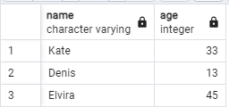

#### Exercise 01 - First steps into SQL world
Please make a select statement which returns names , ages for all women from the city ‘Kazan’. Yep, and please sort result by name.

```sql
select name, age from person
where address = 'Kazan' and gender = 'female'
order by name
```

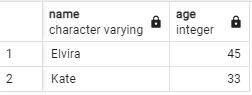

#### Exercise 02 - First steps into SQL world
Please make 2 syntax different select statements which return a list of pizzerias (pizzeria name and rating) with rating between 3.5 and 5 points (including limit points) and ordered by pizzeria rating.

the 1st select statement must contain comparison signs (<=, >=);
the 2nd select statement must contain BETWEEN keyword.

```sql
select name, rating from pizzeria
where rating > 3.5
order by rating
```

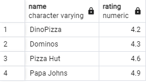

```sql
select name, rating from pizzeria
where rating between 3.5 and 5
order by rating
```

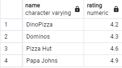

#### Exercise 03 - First steps into SQL world
Please make a select statement that returns the person identifiers (without duplicates) who visited pizzerias in a period from January 6, 2022 to January 9, 2022 (including all days) or visited pizzerias with identifier 2. Also include ordering clause by person identifier in descending mode.

```sql
select distinct person_id from person_visits
where visit_date >= '2022-01-05' and visit_date <= '2022-01-09'
```

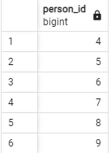

#### Exercise 04 - First steps into SQL world
Please make a select statement which returns one calculated field with name ‘person_information’ in one string like described in the next sample:

Anna (age:16,gender:'female',address:'Moscow')

Finally, please add the ordering clause by calculated column in ascending mode. Please pay attention to the quotation marks in your formula!

```sql
SELECT 
    CONCAT(name, ' (age:', age, ',gender:''', gender, ''',address:''', address, ''')') AS person_information
FROM 
    person
ORDER BY 
    person_information ASC;
```

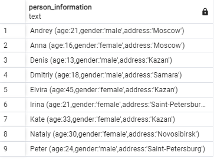

#### Exercise 05 - First steps into SQL world
Write a select statement that returns the names of people (based on an internal query in the SELECT clause) who placed orders for the menu with identifiers 13, 14, and 18, and the date of the orders should be January 7, 2022. Be careful with "Denied Section" before your work.

Please take a look at the pattern of internal query.
SELECT 
    (SELECT ... ) AS NAME  -- this is an internal query in a main SELECT clause
FROM ...
WHERE ...

```sql
select name 
from person
where person.id in (
select person_id
from person_order
where menu_id in (13,14,18) and order_date = '2022-01-07')
```

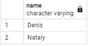

#### Exercise 06 - First steps into SQL world
Use the SQL construction from Exercise 05 and add a new calculated column (use column name ‘check_name’) with a check statement a pseudocode for this check is given below) in the SELECT clause.
if (person_name == 'Denis') then return true
    else return false

```sql
SELECT 
    CONCAT(name, ' (age:', age, ',gender:''', gender, ''',address:''', address, ''')') AS person_information,
    CASE 
        WHEN name = 'Denis' THEN true
        ELSE false
    END AS check_name
FROM 
    person
ORDER BY 
    person_information ASC;
```

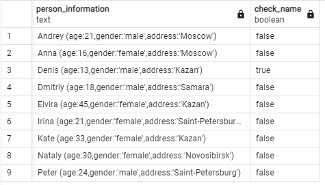

#### Exercise 07 - First steps into SQL world
Let’s apply data intervals for the `person` table. 
Please make a SQL statement which returns a person's identifiers, person's names and interval of person’s ages (set a name of a new calculated column as ‘interval_info’) based on pseudo code below.

```sql
SELECT 
    id,
    name,
    CASE 
        WHEN age >= 10 AND age <= 20 THEN 'interval #1'
        WHEN age > 20 AND age < 24 THEN 'interval #2'
        ELSE 'interval #3'
    END AS interval_info
FROM 
    person
ORDER BY 
    interval_info ASC;
```

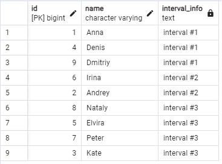

#### Exercise 08 - First steps into SQL world

Please make a SQL statement which returns all columns from the `person_order` table with rows whose identifier is an even number. The result have to order by returned identifier.

```sql
SELECT *
FROM person_order
WHERE id % 2 = 0
ORDER BY id ASC;
```

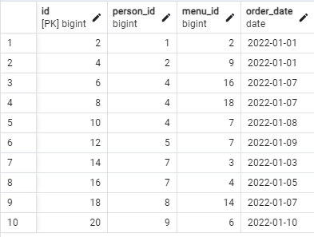

#### Exercise 09 - First steps into SQL world
Please make a select statement that returns person names and pizzeria names based on the `person_visits` table with date of visit in a period from 07th of January to 09th of January 2022 (including all days) (based on internal query in `FROM` clause) .

```sql
SELECT 
    p.name AS person_name,
    pi.name AS pizzeria_name
FROM 
    (SELECT person_id, pizzeria_id 
     FROM person_visits 
     WHERE visit_date BETWEEN '2022-01-07' AND '2022-01-09') AS visits
JOIN 
    person p ON visits.person_id = p.id
JOIN 
    pizzeria pi ON visits.pizzeria_id = pi.id;
```

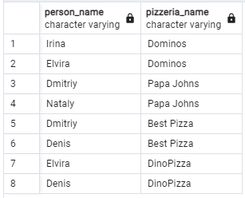
